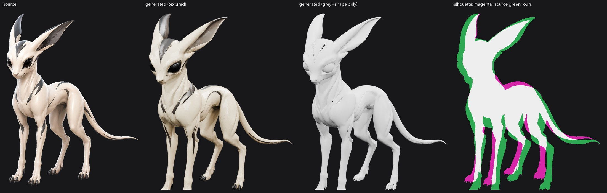
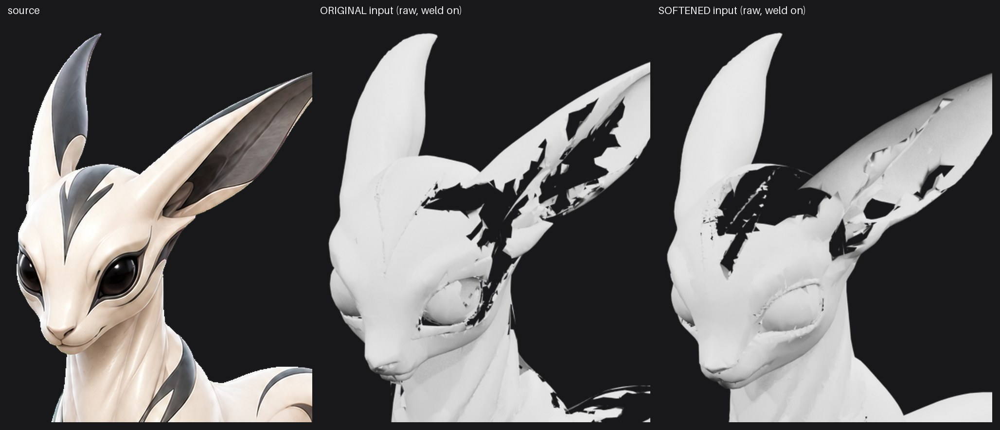
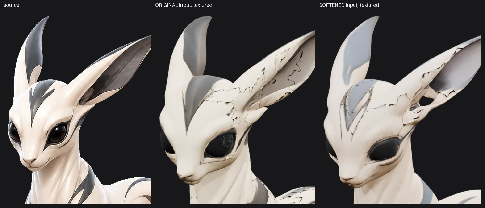
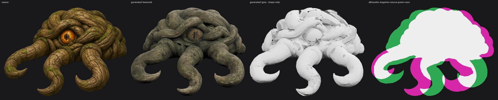
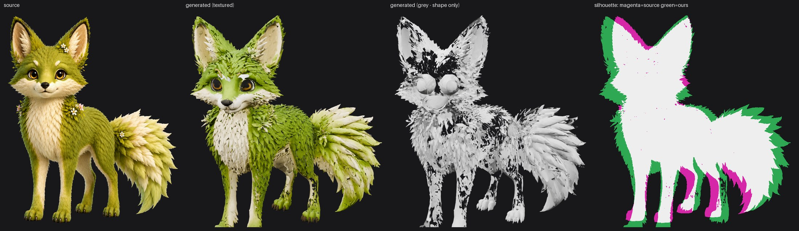

# Baseline — 2026-08-12

**What this doc is.** A single, current snapshot of how close each asset is to the picture
it was generated from, all measured the same way on the same day. Two weeks of experiments
produced a lot of scattered renders that are no longer comparable to each other. This
replaces them. If an older doc disagrees with this one, this one wins.

**The one rule this encodes:** the goal is *closeness to the source image*. Not a lower
tear score, not a smoother mesh in isolation. Everything below is judged against the
original artwork.

---

## How to reproduce any figure here

```bash
# find the camera angle that matches the source (once per subject)
python scripts/compare_to_source.py <source.png> <asset.glb> output/compare \
    --label sweep --sweep "0,45,90,135,180,225,270,315"

# then the four-panel comparison at that angle
python scripts/compare_to_source.py <source.png> <asset.glb> output/compare \
    --label <name> --azimuth <deg> --elevation 8
```

The four panels are **source**, **generated (textured)**, **generated (grey)**, and a
**silhouette overlay**.

Two of those need explaining:

- **Grey panel.** Every texture is stripped and the surface is painted plain grey, with
  *backface culling* on — meaning surfaces facing away from the camera are not drawn. So
  anything black inside the body is somewhere you can see straight through the model. This
  is what a game engine shows; a normal preview hides these by drawing both sides.
- **Silhouette panel.** The two outlines on top of each other. Magenta = the source had
  material here and we don't; green = we have material the source doesn't; white = they
  agree. Both are scaled to the same height first, because how close the camera sits is
  arbitrary — so this panel judges **proportion, not size**. A hairline of colour around
  the edge is a rounding artefact, not a defect.

Camera angles, found once and now fixed:

| Subject | Azimuth | Elevation |
|---------|---------|-----------|
| Flicker | 130 | 8 |
| Snag | 95 | 8 |
| Fox | 210 | 8 |

Azimuth 0 is in front of the asset; the number rises as the camera swings around it.

---

## Flicker



**Closest asset on shape, worst on surface damage.**

| Defect | Status | Evidence |
|--------|--------|----------|
| Painted markings carved into the mesh as grooves | **Confirmed, dominant** | grey panel: the forehead V and eye rim are physical trenches with holes in them |
| Those grooves torn through into see-through holes | **Confirmed, 2.67% of body averaged over 8 angles** | measured on the culled grey renders |
| Proportions | **Good** | silhouette is mostly white; ears slightly thick, leg offsets are pose not shape |
| Texture exposure | **Good — not a problem** | body brightness 216 vs source 223, contrast 3.52 vs 3.47 |
| Marking coverage | Slightly thin | dark pixels 15.0% of body vs the source's 19.2% |

The damage sits **only** where the source artwork has dark paint. Elsewhere the surface is
smooth. The mechanism: the generator reads a hard dark line on a light body as a shadow,
a shadow implies a dent, so it builds a dent — and the dent then tears when the mesh is
simplified.

**Do not carry Snag's texture diagnosis over to Flicker.** Flicker's texture is correctly
exposed. Its problem is geometry caused by texture *in the input*.

### Today's experiment: soften the markings before generating

`scripts/soften_markings.py` lightens flat painted markings in the input image, leaving
eyes and claws alone (they are genuinely dark and genuinely recessed). One run,
`manifests/flicker-all4s-soft050.json`, identical to `flicker-all4s.json` apart from the
input image. 347 seconds.





Measured all the way around, not at one angle — because the first read of this experiment
was taken at azimuth 130 alone and generalised, which was wrong:

| Azimuth | Original input | Softened 0.5 | Softened, ears protected |
|---------|---------------|--------------|--------------------------|
| 0 | 0.88% | 0.38% | **0.09%** |
| **45** | 1.23% | **2.20%** ✗ | 1.24% |
| **90 (dead front)** | 1.00% | **2.52%** ✗ | 1.03% |
| 130 | 3.33% | **0.99%** | 1.99% |
| 180 | 5.01% | 1.59% | **1.52%** |
| 225 | 4.99% | 2.61% | **1.94%** |
| 270 | 2.96% | 0.66% | **0.40%** |
| 315 | 2.16% | 0.57% | **0.16%** |
| **All round** | **2.67%** | **1.43%** | **1.07%** |

Marking coverage, against the source's 19.2%: baseline 15.0%, softened 10.0%,
**ears protected 12.6%**.

The middle column halved holes overall but got **worse from the front** — the angle you
look at first — and the whole regression was in the ear. Protecting the ears (right-hand
column) fixes that: **holes down 60% from baseline with no angle meaningfully worse than
baseline**, and it recovers part of the marking loss too.

**Current best Flicker:**
`output/conditional/3-4th-front-flicker-all4s-alpha-soft050ears__trellis2__commercial-conditional__8f7c43934043.glb`
(`manifests/flicker-all4s-soft050-ears.json`).

### Why the ear got worse, and the rule it gives us

Softening treats every dark region as flat paint. The forehead V *is* flat paint. **The ear
interior is not** — it is dark because it is a real hollow, and that darkness is a genuine
depth cue. Lightening it told the generator the ear is flatter than it is, so it built a
thin membrane that tore.

**The rule:** soften dark regions that are *paint*; never soften dark regions that are
*shading of real geometry*. `soften_markings.py` already protects the very darkest pixels
(eyes, claws) via `--low`, but the ear sits in the mid-range and gets caught.

We tried to separate the two automatically before resorting to a mask. **Local variance
does not work:** measured on Flicker, the ear interior's local standard deviation is
24–47 and the painted markings are 37–43. The ranges overlap, so no threshold separates
them — the region has to be *named*, not inferred.

So `soften_markings.py` gained `--protect <mask.png>`, a greyscale mask where white means
"leave alone". Hand-painting it is entirely reasonable. Flicker's
(`assets_to_test/flicker-ear-protect-mask.png`) is derived from the image itself: the
large dark connected components whose centre of mass sits above the forehead marks,
dilated and feathered.

**Apply the rule to any new subject:** before softening, look at every dark region and ask
whether it is *paint on a surface* or *a hollow you are looking into*. Protect the hollows
— ear cups, nostrils, open mouths, under-chin, deep-set eye sockets.

**Still not done:** darkening the markings back into the finished texture (12.6% coverage
against the source's 19.2%).

### A trap this experiment nearly fell into

The first comparison was against `output/regions/flicker_c_gloss_normal.glb` and made the
new run look *worse*. That file is a **processed** asset; the new one was **raw** generator
output. Two variables, so the comparison was meaningless. The fair baseline is
`...__0a4c509ce62a.glb` — raw, same settings, weld patch active, only the input image
differs. Always check `created_at` in the provenance sidecar against the date of whatever
patch you are testing.

---

## Snag



**Shape is close. Colour is completely wrong.**

| Defect | Status | Evidence |
|--------|--------|----------|
| Colour is dead — golden amber source, grey-green output | **Dominant, untouched** | the textured panel |
| Eye has lost its glow | **Self-inflicted, and already solved — see below** | source: bright amber iris; ours: flat tan disc |
| Coils fused and fattened | **Untouched** | source has separate ropes with air between; ours is a braid-shaped mass |
| Apparent tearing across the coil mass | **Mostly not real — see below** | |

Earlier measurement on the shipped texture: brightness 63.1 → 31.2, saturation
0.698 → 0.426, and the brightest 5% of pixels 123 → 54. The top end is simply gone, which
is why wood grain reads as sludge.

### The flat eye is our own doing, not the generator's

The Snag manifests set `"material_mode": "matte"`. That mode does more than fix the glassy
look — `_normalize_glb_material` drops **all** metalness: `metallicFactor` to 0, matte
roughness, and the metallic-roughness texture removed entirely. A wet, glossy eyeball has
nowhere left to live, so it flattens into a tan disc.

It is the right default for the *body* — bark is matte and its shading is already baked
into the colour. It is wrong for the eye.

**The fix already exists and has been run before:** mask the eye and give that region its
gloss back. `output/regions/thorn_eye_mask.png` is the mask, and `docs/finishing.md` has
the invocation (`--gloss-mask ... --gloss-roughness 0.3`). So do not read "the eye is
dead" as a texture-grading problem — grading the colour will not bring back a highlight
that has no material to sit on. Restore the gloss first, then grade.

### Correction: most of Snag's "tears" are flipped faces

The grey panel shows black gashes across the coil mass. Re-rendering with **Recalculate
Outside** — a Blender operation that makes every face point outward — removes almost all of
them.

So those areas are not missing geometry; they are surfaces facing the wrong way. Backface
culling hides them, which is why they read as holes and why they *would* have looked like
holes in the game. `scripts/blender_fix_normals.py` already exists and is nearly free
compared to regenerating.

**Caveat, and it matters:** this is per-asset. Recalculating normals has previously made
other assets in this repo *worse*, tearing solid regions open. Always render both ways
before believing either.

---

## Fox



**The closest of the three. No blocking defect.**

| Defect | Status |
|--------|--------|
| Colour over-saturated — vivid grass green vs the source's muted olive | Main gap |
| Moss reads as chunky overlapping leaves rather than fine fur | Secondary; may be a resolution limit |
| Form, proportions, ears, tail, eyes | Good |

The fox needs grading, not surgery. It is the right subject to test texture work on,
because its geometry will not confuse the result.

---

## What this baseline retires

**The tear metric is no longer a gate.** It measures the mesh against itself, so it cannot
see a dead texture, a missing sheen, or a marking that came out thin. It had already
collected three caveats; Flicker added a fourth when its tear score halved while the mesh
visibly got worse. Keep printing it as a diagnostic. Never ship on it.

**Judge with the four-panel comparison and your eye.** That is what the goal actually is.

## Open, in priority order

1. **Flicker** — protect the ears from softening and re-run. This is the one change that
   would make the softened version better than the baseline *at every angle* rather than
   most of them. Then darken the markings back into the finished texture.
2. **Snag** — restore the eye's gloss with the existing mask *before* touching colour; a
   highlight cannot be graded back onto a material that has no metalness.
3. **Snag** — the body colour. `lift_lightness.py` before `colour_match_albedo.py`,
   because a 95th-percentile of 54 says the highlights need recovering before chroma is
   graded. Neither has been run on this asset.
4. **Snag** — run `blender_fix_normals.py` and re-baseline; it may be most of the
   remaining "damage".
5. **Fox** — grade the colour down toward the source's olive.
6. **Everything** — stop sweeping `bake_target_faces`, decimation ratio and voxel size.
   Five sweeps, four withdrawn conclusions. That lane is measured out.
