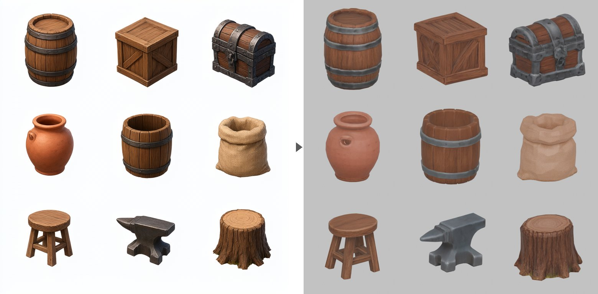

# Prop sheets: many props from one image, in one run



A **prop sheet** is one image holding a grid of separate props: barrels, crates, a chest.
Pixal3D turns the whole sheet into 3D in a single run, and the **Props** tab takes it apart
into separate, upright, named props, each with game-ready levels of detail.

It is for **props**: things that stand on their own and read from any side. Characters
want the detail of a run to themselves.

Built by [@AdrielSantana](https://github.com/AdrielSantana).

## 1. Make the sheet

Use **Generate Image**, or bring your own picture. This prompt made the sheet above
(Qwen-Image, default settings, 768x768):

```text
A 3x3 grid of nine separate medieval fantasy game props, evenly spaced with generous
empty space between them, each one isolated and not touching any other: a wooden
barrel, a wooden crate, an iron-bound treasure chest, a clay pot, a wooden bucket, a
burlap grain sack, a small wooden stool, an iron anvil, a tree stump. All props at a
similar size, all shown from the same slightly elevated three-quarter view, stylized
hand-painted game asset style, soft even studio lighting, plain white background, no
ground shadows, no text, no labels, no grid lines, no borders
```

What matters in it:

- **Space between props.** Props that touch or overlap in the picture are split as one.
- **Similar sizes.** Pixal3D drops very small parts as crumbs, so a much smaller prop
  can go with them.
- **A slight view from above.** Pixal3D sees the tops and models them; the split
  stands each prop back up afterwards. At eye level, the tops come back invented.

The pictures Qwen-Image makes are yours ([Qwen's statement](https://x.com/QwenDevs/status/2101917379785838660)), and so are the props made from them.

## 2. Turn it into 3D

In **Generate 3D**, pick **Pixal3D** and the sheet, and keep the default settings
(resolution 1024, field of view 20°).

## 3. Split and finish in the studio

In the studio, press **+ Create**, start from the sheet's picture and pick **Nine props**: it
makes the 3D model and splits it. A sheet that is already split can be split again from the
Steps panel. Props come out numbered (`prop_01` … `prop_09`, top row first, left to right).
From the command line, `scripts/blender_split_props.py` also takes names in that order.

Each prop comes out:

- **Separate, upright and named**, with its origin at the bottom centre.
- **With three levels of detail (LODs)**: lighter copies a game swaps in with distance,
  5,000, 2,500 and 1,000 triangles. Each is baked from the original with a normal map
  (the surface relief the triangles no longer carry) and a metallic-roughness map, so
  iron stays dark metal and wood stays matte.
- **In two file types**: a plain `.glb` for any engine, and a compressed `.web.glb`
  (WebP textures, compressed mesh, a few hundred KB) for web games. three.js reads it;
  for other engines, check they support `EXT_meshopt_compression` and `EXT_texture_webp`.
  The `.web.glb` needs gltfpack: one click in **Setup & Status**.

Click a prop's chip to see it in 3D and download its files.

**If a prop faces sideways, press Turn 90°.** A box drawn almost exactly corner-on is a
coin toss between its front and its side; those get a ⚠ on their chip. Turn 90° re-bakes
just that prop. Click again to turn it again. If a turn fails or you cancel it, the prop
stays as it was.

**Why props need standing up.** The sheet is drawn from a little above, so Pixal3D tips
each prop back to show its top. The split undoes that, and turns box-like props to
face the front. Round and soft ones are left alone, since turning them would swing their
painted front away.

Runs live in `output/props/<sheet>__props__<time>/`. The tab also shows which licence the
props inherit from the generated model.

## Limits

- **Some bend stays**: a few degrees, from how the sheet was drawn.
- **Less detail per prop** than a run of its own, since nine props share one run.
- **The front of a round prop is wherever it was drawn.** Nothing turns it.

## From the command line

The same steps without the viewer:

```bash
# 2. Sheet to 3D
python scripts/pixal3d_generate.py sheet.png output/sheet/sheet.glb --res 1024

# 3. Split (names in reading order; --turn chest=90 turns one prop)
blender -b --factory-startup --python-exit-code 1 -P scripts/blender_split_props.py -- \
    output/sheet/sheet.glb output/sheet/split \
    --names barrel crate chest clay_pot bucket grain_sack stool anvil tree_stump

# 4. LODs, bakes and compression (--lods to change counts, --resume to keep finished LODs)
python scripts/finish_props.py output/sheet/split output/sheet/finished
```

The split writes `props.json` and the finish writes `finish_props.json`, a record of what
was done to each prop and what each file really holds.
